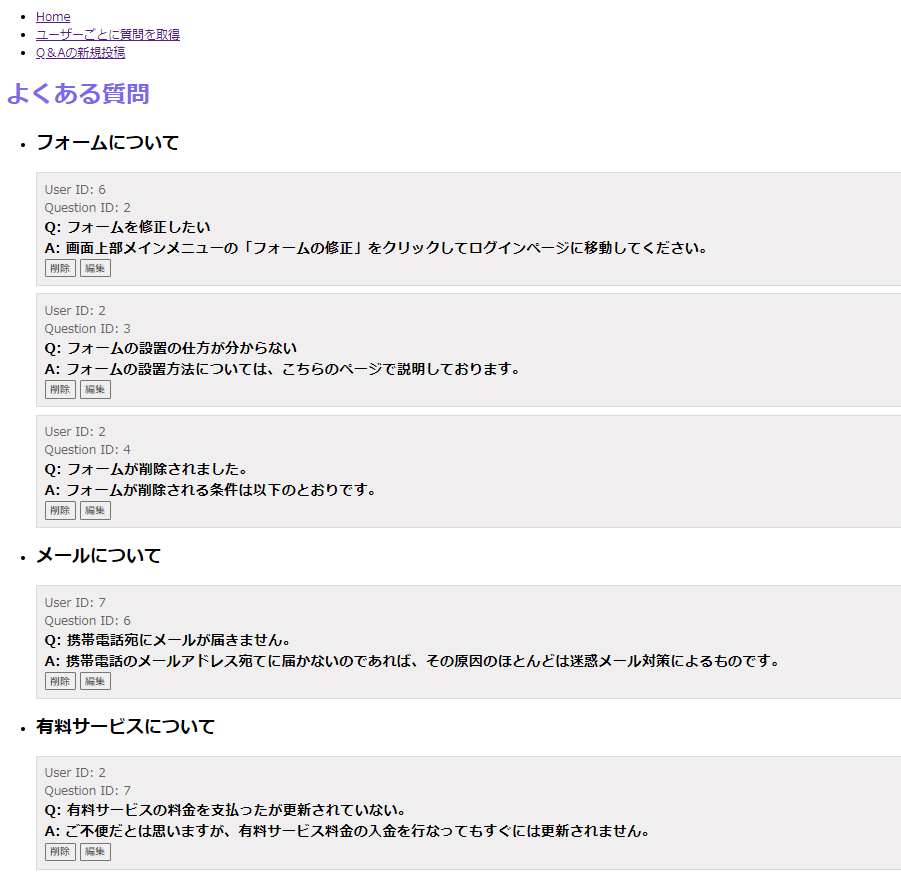
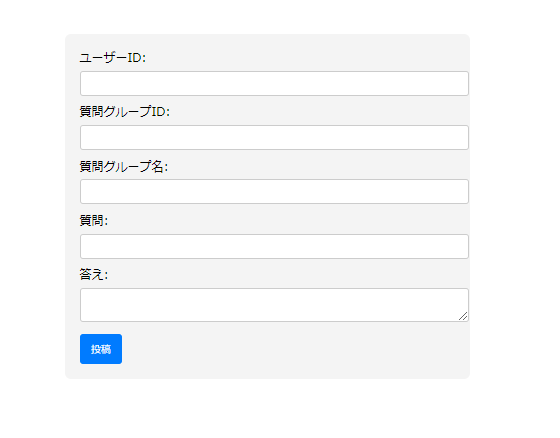
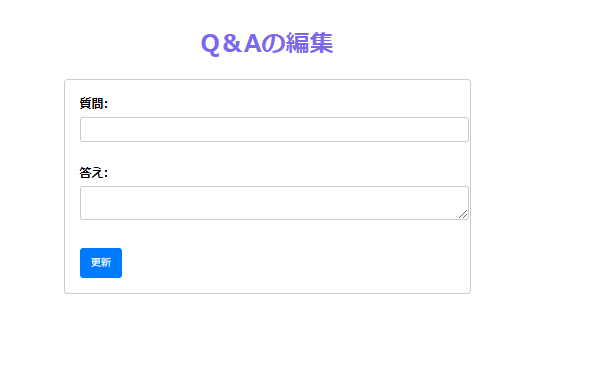
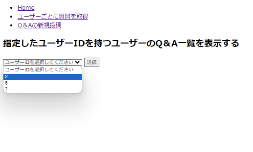
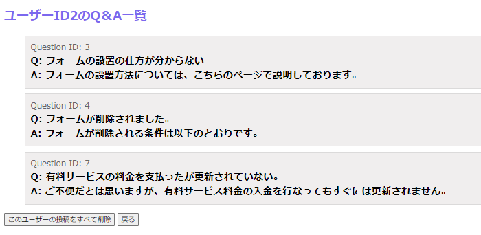

### 質問グループごとに質問を表示 
  http://localhost:5173/

  それぞれのQ＆Aについて、削除ボタン、編集ボタンがついている。削除ボタンを押すとその質問を削除、編集ボタンを押すと編集ページにとぶ。




### 質問を新規投稿
  http://localhost:5173/posts



### 質問の編集ページ
http://localhost:5173/update/(指定した質問の質問
ID)

質問本文と回答本文を修正



### ユーザーIDを選択
http://localhost:5173/users

送信ボタンを押すと、それぞれのユーザーの質問一覧画面にとぶ



### 指定したユーザーの質問一覧画面
  http://localhost:5173/users/(指定したユーザーのID)

「このユーザーの投稿をすべて削除」ボタンを押すと、指定したユーザーの投稿がすべて削除される。




# create-svelte
Everything you need to build a Svelte project, powered by [`create-svelte`](https://github.com/sveltejs/kit/tree/main/packages/create-svelte).

## Creating a project

If you're seeing this, you've probably already done this step. Congrats!

```bash
# create a new project in the current directory
npm create svelte@latest

# create a new project in my-app
npm create svelte@latest my-app
```

## Developing

Once you've created a project and installed dependencies with `npm install` (or `pnpm install` or `yarn`), start a development server:

```bash
npm run dev

# or start the server and open the app in a new browser tab
npm run dev -- --open
```

## Building

To create a production version of your app:

```bash
npm run build
```

You can preview the production build with `npm run preview`.

> To deploy your app, you may need to install an [adapter](https://kit.svelte.dev/docs/adapters) for your target environment.
